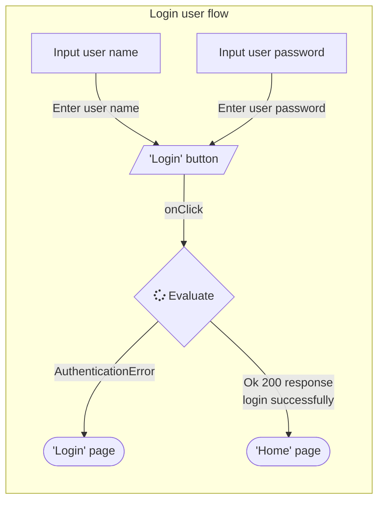
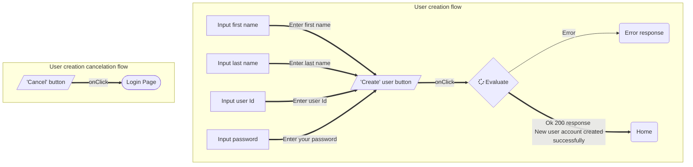

# Login Screen Component

## Requirements

- [X] The person using your application should have a way of impersonating/logging in as an existing user.
- [X] Create your own account creation process to allow a user to sign up for an account. 
- [X] Once the user logs in, the home page should be shown.
- [] We always want to make sure we know who the logged in user is, so information about the logged in user should appear on the page. 
- [] If someone tries to navigate anywhere by entering the address in the address bar, the user is asked to sign in and then the requested page is shown. 
- [] The application allows the user to log out and log back in.

## `Login` button

General login or sign in flow (created using using mermaid).

## `Create` account button

## References
1. [Mermaid graph](#https://mermaid.live/)